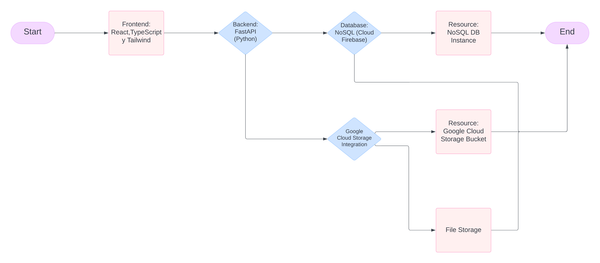

To run it :
uvicorn app.main:app --reload

# Nombre del Proyecto
FinPath

## 1. Introducción
Nuestro proyecto resuelve el problema de [descripción]. Está diseñado para [funcionalidad clave].

## 2. Tecnologías Usadas
- Python
- React
- TypeScript
- Tailwind
- FastAPI
- Google Cloud
- Gemini

## 3. Arquitectura del Proyecto

- Frontend: Desarrollado en React, Tailwind CSS y TypeScript.
- Backend: API's construidas en FastAPI.
- Base de datos: Almacenamiento en Firebase.

### Requisitos:
- Python 3.8+
- Activar el ambiente virtual venv
- Instalar los requirements
- Node.js 14+

### Instrucciones de Instalación:
1. Clonar el repositorio:

## 5. Funcionalidades Principales
- **Login de Usuarios**
- **Análisis de datos financieros**
- **Visualización de gráficos**

## 6. APIs y Endpoints
- `POST /login`: Autentica al usuario.
- `GET /reportes`: Devuelve los gráficos financieros del usuario.

## 7. Base de Datos
[Descripción del esquema de la base de datos]

## 8. Interfaz de Usuario
[Incluye capturas de pantalla o descripciones]

## 9. Próximos Pasos
- Poder linkear el login a usuarios de Banorte.
- Si es usuario actual de Banorte, lo direccionara para poder gestionar sus finanzas, chequear graficos de historial financiero y ver las recomendaciones para poder invertir.
- Implementar medidas de seguridad en login o registro.
- Cuestionario inicial para conocer al usuario, que la IA adapte el contenido a las respuestas del usuario.
Dividir por categorias los conocimientos financieros del usuario: NOVATO, INTERMEDIO, EXPERTO. Si el user es NOVATO, se le direccionara al curso de educacion financiera.
- Implementar un análisis predictivo de acuerdo a los archivos financieros subidos.
- Seccion para mostrar un catalogo de opciones para que el usuario pueda saber en que invertir y 
como invertir de acuerdo a sus gustos, necesidades y estatus socioeconómico
asi lo desea.

## 10. Autores
- Juan Pérez - Backend
- María López - Frontend

# PythonBackend
Backend para python:

Posible stack de python y workflow

FastAPI Para la generacion de las APIs>

Conectando a base de datos posiblemente hosteado en GoogleCloud

app/: Main application package.
main.py: Entry point for the FastAPI app.
core/: Core settings and configurations.
config.py: Configuration variables and settings.
api/: API routers and endpoints.
endpoints/: Individual endpoint definitions.
services/: Integrations with external services (e.g., Google Cloud).
models/: Pydantic models and data schemas.
utils/: Utility functions and helper methods.
tests/: Test cases for your application.

SETUP
git pull
activate virtual env
pip install 

# Endpoints:

All will be using the endpoint /api/

FEDERICO

POST
user/register/

POST
user/login/ --Utilizing Firebase AUTH

GET
user/{id}/path/

GET
user/{id}/{auth}/info/ -- All importan information to make sure to build unique dashboard for person. {{DISCUSSION NEEDED}}

Edson

POST
user/{id}/createPath ->> Path
information : 'String... All of the things that were mentioned in the initial survey to make sure its unique path'

{
[{level : numberOfLevel, moduleName : "nameOfModule", moduleInfo:".... Info info about module", next: [NextModules, can be one or two at maximum like a binary tree]}...
Maximum of 7 modules
]
}

Emi

POST
user/{id}/{moduleName}/createSurvey
GET
user/{id}/{moduleName}/getSurvey

Baca

POST 
user/{id}/finPal ---- Info retrieved in the POST, answers to that specific question. (Baca sabra que mas se necesita)

